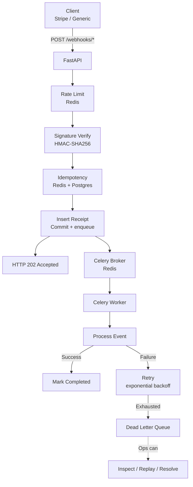

# Webhook Handler

A production-grade webhook processor that was built focusing on mainly handling duplicate events, logging proper records of failures, and maintaining trust with idempotency, signature verification, retries, and a dead-letter queue.

**Status:** Backend deployed on Render (free tier) — see
[API docs](https://webhook-backend-2tdx.onrender.com/docs) and
[health check](https://webhook-backend-2tdx.onrender.com/health).
Dashboard live at [webhook-dashboard-5sk4.onrender.com](https://webhook-dashboard-5sk4.onrender.com).
Full stack runs locally via Docker Compose, tested end-to-end including real failure/retry/DLQ scenarios under concurrent load (see [docs/dlq_evidence.md](./docs/dlq_evidence.md)).

---

## Quick Navigation

If you have five minutes, read these four sections in order:

- **[What This Does](#what-this-does)** — the feature list, one line each
- **[Architecture](#architecture)** — how the pieces fit together
- **[Production Verification](#production-verification)** — proof the system works live, with real curl output and logs
- **[Two Environments, Two Classes of Bugs](#two-environments-two-classes-of-bugs)** — the honest answer to "how do you know it works?"

**Full contents:**

| Section                                                                        | What it covers                         |
| ------------------------------------------------------------------------------ | -------------------------------------- |
| [The Problem](#the-problem)                                                    | Why webhook handling is hard           |
| [Who This Is For](#who-this-is-for)                                            | The businesses that need this          |
| [What This Does](#what-this-does)                                              | Feature list                           |
| [Architecture](#architecture)                                                  | Diagram + component table              |
| [Quick Start](#quick-start)                                                    | Docker Compose and native setup        |
| [Verify It Works](#verify-it-works)                                            | How to test locally                    |
| [Test Evidence](#test-evidence)                                                | 15 end-to-end scenarios                |
| [Bugs Found and Fixed (Local)](#bugs-found-and-fixed-local-testing)            | 3 bugs caught by local tests           |
| [Production Deployment](#production-deployment--live-on-render)                | Live service URLs, free-tier mode      |
| [Production Bugs Found and Fixed](#production-bugs-found-and-fixed)            | 7 bugs caught by deploying             |
| [Production Verification](#production-verification)                            | Live curl tests and log evidence       |
| [Two Environments, Two Classes of Bugs](#two-environments-two-classes-of-bugs) | Local vs. production failures compared |
| [Design Decisions](#design-decisions)                                          | Trade-offs explained                   |
| [Project Structure](#project-structure)                                        | Folder layout                          |

---

## The Problem

Every service that accepts webhooks eventually hits the same wall:

- **Duplicates.** Stripe and other providers re-deliver webhooks when they don't receive a 2xx response — timeouts, network failures, or your own server errors. The same event can arrive twice, three times, or twenty.

- **Failures.** Your webhook handler often calls other services (payments API, notification service) to finish processing. If any of them is slow or down, the webhook can fail mid-processing — losing the event and leaving no audit trail.

- **Trust.** The webhook URL is public. Without cryptographic verification, anyone can POST a payload that looks like it came from Stripe. If your handler trusts it, attackers can trigger arbitrary business logic.

---

## Who This Is For

Any business that accepts payments, subscriptions, or third-party events via webhooks:

- **SaaS companies** using Stripe for billing — a duplicate webhook means a customer is charged twice.
- **E-commerce platforms** integrating with fulfillment, shipping, or inventory APIs.
- **Fintech apps** receiving transaction or KYC events from banking partners.

Without a system like this, each of those businesses eventually loses money to:

- Duplicate charges (which require refunds, customer support, and reputation damage)
- Silent failures (which trigger "my payment didn't go through" tickets)
- Forged events (which can trigger credits, refunds, or data exposure)

In one sentence: This system makes webhook handling safe, auditable, and recoverable — so a business can trust its integrations without building a team to babysit them.

## What This Does

- **Idempotent ingestion.** Redis fast-path + PostgreSQL unique constraint. Duplicates never double-process.
- **Signature verification.** Stripe's HMAC-SHA256 algorithm, implemented from scratch with timing-safe comparison and replay protection.
- **Async processing.** Webhooks return 202 in milliseconds; Celery workers handle the heavy lifting.
- **Exponential backoff retries.** Transient failures retry up to 5 times (60s → 960s). Permanent failures skip straight to the DLQ.
- **Dead Letter Queue.** Every terminal failure is recorded with full context. Ops can list, replay, or resolve.
- **Rate limiting.** Fixed-window Redis counter, per provider path.
- **Admin API auth.** All `/admin/*` routes require an `X-API-Key` header, verified with timing-safe comparison.
- **Prometheus metrics.** `/metrics` endpoint exposes counters, gauges, and histograms across all processes (API, worker, beat) using multiprocess mode.
- **Self-healing reconciliation.** A periodic sweep re-enqueues stuck webhooks. Lost tasks recover without human intervention.

---

## Architecture



**Components:**

| Layer   | Technology | Role                                                     |
| ------- | ---------- | -------------------------------------------------------- |
| API     | FastAPI    | Receive webhooks, verify signatures, enforce rate limits |
| Cache   | Redis      | Idempotency fast-path, rate limiting, Celery broker      |
| Storage | PostgreSQL | Source of truth for receipts + DLQ                       |
| Workers | Celery     | Async processing, retries, DLQ movement                  |

---

## Quick Start

### Option A — Docker Compose (recommended, tested end-to-end)

**Prerequisites:** Docker Desktop.

```bash
# 1. Clone
git clone <repo-url>
cd webhook-handler

# 2. Configure
cp .env.example .env.docker
# Edit .env.docker with your Stripe webhook secret and admin API key

# 3. Start the full stack (API, worker, beat, Postgres, Redis)
docker compose --env-file .env.docker up -d --build

# 4. Confirm everything is healthy
docker compose ps
```

### Option B — Native (Python + local Postgres/Redis)

Not covered by this repo's own test evidence — included for reference if you'd rather not use Docker, but verify it works in your environment before relying on it.

**Prerequisites:** Python 3.12+, PostgreSQL, Redis (or Memurai on Windows).

```bash
# 1. Install
python -m venv myenv

# Activate:
#   macOS/Linux:        source myenv/bin/activate
#   Windows (PowerShell): .\myenv\Scripts\Activate.ps1
#   Windows (cmd.exe):     myenv\Scripts\activate.bat

pip install -r requirements.txt

# 2. Configure
cp .env.example .env
# Edit .env with your PostgreSQL password and Stripe webhook secret

# 3. Create tables
python create_tables.py

# 4. Run (3 terminals)
uvicorn app.main:app --reload
celery -A app.workers.celery_app worker --pool=solo --loglevel=info
celery -A app.workers.celery_app beat --loglevel=info
```

---

## Verify It Works

```bash
# Health check — should return redis: true, postgres: true
curl http://localhost:8000/health
```

```bash
# Send a test webhook
curl -X POST http://localhost:8000/webhooks/generic \
  -H "Content-Type: application/json" \
  -H "Idempotency-Key: test-001" \
  -H "X-Event-Type: payment.test" \
  -d '{"user_id":"123","amount":100}'
```

Additional test resources (verify these still pass against the current code before relying on the claim below):

```bash
python tests/helpers/run_stripe_tests.py
cat tests/manual_test_checklist.md
```

---

## Test Evidence

15 end-to-end scenarios covering the checklist below. See `tests/manual_test_checklist.md` for the full procedure.

| #   | Scenario                             | Result                    |
| --- | ------------------------------------ | ------------------------- |
| 1   | Health check                         | 200, all checks true      |
| 2   | New webhook                          | 202 Accepted              |
| 3   | Duplicate (Redis fast-path)          | 200, cached response      |
| 4   | Conflict (same key, different event) | 409                       |
| 5   | Missing Idempotency-Key              | 422                       |
| 6   | Malformed JSON                       | 400                       |
| 7   | Stripe valid signature               | 202                       |
| 8   | Stripe invalid signature             | 400                       |
| 9   | Stripe stale timestamp               | 400                       |
| 10  | DLQ list                             | 200                       |
| 11  | DLQ replay — not found               | 404                       |
| 12  | Rate limit exceeded                  | 429                       |
| 13  | Redis flush → Postgres fallback      | 200, cached               |
| 14  | Transient failure → retry            | retry counter incremented |
| 15  | Permanent failure → DLQ              | dead_lettered + DLQ row   |

Plus three real concurrency/correctness bugs found and fixed during development — see [docs/bugs.md](./docs/bugs.md) — and a full real-failure trace with actual timestamps, DB rows, and API responses in [docs/dlq_evidence.md](./docs/dlq_evidence.md).

---

## Bugs Found and Fixed (Local Testing)

Three real bugs surfaced during local development — all found through testing, not code review. Full postmortems: [docs/bugs.md](./docs/bugs.md).

### Bug 1 — Idempotency fast-path bypass

The Redis cache stored the response keyed on the `idempotency_key` alone, without the `event_type`. A duplicate detection check on the fast path couldn't tell a genuine duplicate from a different event reusing the same key — so it returned the _wrong_ cached response with HTTP 200. Silent data loss.

**Fix:** store `event_type` in the cache, compare on the fast path, return 409 on mismatch.

### Bug 2 — Replay counter race condition

The DLQ replay cap (max 3) was enforced with a read-then-check-then-write pattern — a TOCTOU race. Two concurrent requests could both pass the check and both increment.

**Fix:** move the cap into the SQL UPDATE's `WHERE` clause so the check-and-write is one atomic statement. Verified under real 4-way concurrent replay traffic: exactly 3 succeeded, the 4th was correctly rejected, no lost updates.

### Bug 3 — Event-loop collision between independent task modules

`process_webhook.py` and the reconciliation sweep each kept their own private asyncio event loop, while sharing one SQLAlchemy connection pool. An asyncpg connection opened on one module's loop would fail when reused on the other's — crashing the sweep on every single invocation.

**Fix:** one shared event loop for the entire worker process instead of one private loop per module. Verified clean across ~3 hours and 25+ scheduled sweep ticks under real concurrent retry/DLQ activity, including through a system sleep/resume gap.

---

## Production Deployment — Live on Render

Beyond the local test suite above, this project is deployed live and was stress-tested against real infrastructure. The deployment surfaced a second class of bugs — **integration bugs** — that local testing could not have caught. They are documented here in full because they are the honest story of the project.

**Live services:**

| Service   | URL                                              | Runtime               |
| --------- | ------------------------------------------------ | --------------------- |
| API       | https://webhook-backend-2tdx.onrender.com        | FastAPI (Python 3.11) |
| API docs  | https://webhook-backend-2tdx.onrender.com/docs   | OpenAPI / Swagger     |
| Health    | https://webhook-backend-2tdx.onrender.com/health | Liveness + readiness  |
| Dashboard | https://webhook-dashboard-5sk4.onrender.com      | Next.js 16            |
| Redis     | Render Valkey 8                                  | Idempotency + broker  |
| Postgres  | Render PostgreSQL 18                             | Source of truth       |

**Free-tier demo mode.** Render's Background Worker service is not free. To keep this demo running on free infrastructure without deleting the async architecture, the codebase supports two dispatch modes:

- **Production mode** — webhooks dispatch to a Celery worker via `process_webhook_task.delay()`. Requires a Background Worker service.
- **Free-tier demo mode** — webhooks process inline via FastAPI's `BackgroundTask`, calling the same `_process()` function the Celery task calls. Same state machine, same pipeline events, same DLQ logic. No retries/backoff (there is no queue to retry into), but everything else is identical.

The mode is controlled by the `CELERY_ENABLED` env var. Both code paths are visible in `app/api/routers/generic_webhooks.py` — the Celery dispatch is kept as commented-out code so the intended production architecture is preserved in the source.

---

## Production Bugs Found and Fixed

Seven integration bugs surfaced during the first production deploy. Unlike the three bugs above (which were caught by local tests), these only appeared against real infrastructure — Render, HTTPS, real env vars, real browser clients. They are the difference between "the code works" and "the system works."

### Bug 4 — Env var name mismatch between services

The dashboard service read `DASHBOARD_API_TOKEN` from its env; the backend service expected `ADMIN_API_KEY`. Different names, same intended secret. Every dashboard request to the backend returned 401.

**Fix:** rename the dashboard's env var to match what the backend's code reads, and confirm both sides use the same value.

### Bug 5 — `Settings` object missing attributes at runtime

Twice during deployment, code read a `Settings` attribute that was never declared in the Pydantic `Settings` class:

- `settings.DASHBOARD_API_TOKEN` — never declared. Backend crashed on every request.
- `settings.WS_PUBLIC_TOKEN` — never declared. WebSocket auth raised `AttributeError` on every connection.

Because the code read the attribute at request time, the app booted fine and only failed when traffic arrived.

**Fix:** add each field to the `Settings` class in `app/core/config.py`. Both are now declared, so Pydantic validates their presence at startup.

### Bug 6 — Wrong HTTP header name for auth

The dashboard sent `Authorization: Bearer <token>`. The backend's `require_dashboard_access` dependency read `authorization` (lowercase, no alias). FastAPI's `Header(...)` parameter matching is case-sensitive on the alias, so the header was never found.

**Fix:** add `alias="Authorization"` to the FastAPI `Header(...)` declaration, or read the header directly from `request.headers.get("authorization")` (case-insensitive).

### Bug 7 — Enum case mismatch in metrics repository

`metrics_repository.py` compared `WebhookStatus.success`, but the enum members are `PENDING`, `PROCESSING`, `SUCCESS`, `DEAD_LETTERED`. Python is case-sensitive. Every call to `/metrics/summary` raised `AttributeError: success`.

**Fix:** replace all lowercase enum references with their uppercase equivalents throughout the repository layer.

### Bug 8 — Duplicate responses returned the wrong status string

On a duplicate webhook hit, the API correctly returned HTTP 200 and the original `receipt_id`, but the response body always said `"status": "accepted"` — indistinguishable from a fresh insert. The `is_new` flag was set correctly on `IngestionResult`, but the router ignored it when constructing the response body.

**Fix:** in `generic_webhooks.py`, use `"status": "accepted" if result.is_new else "duplicate"`. The HTTP status code already distinguished the two cases; now the body does too.

### Bug 9 — WebSocket router never registered

`app/api/routers/pipeline_ws.py` defined the `/ws/pipeline` route, but `app/main.py` never imported or included it. Every WebSocket connection was rejected at the router level — the handler never ran. This is why the dashboard's "Live pipeline" panel stayed on "Connecting…" indefinitely.

**Fix:** add `from app.api.routers.pipeline_ws import router as pipeline_ws_router` and `app.include_router(pipeline_ws_router)` to `app/main.py`.

### Bug 10 — Startup routine blocked the port scanner

The `lifespan` function ran `await init_redis()` and `await Base.metadata.create_all()` before yielding. On the free tier, both can be slow (~45s combined cold-start). Render's port scanner gives up after ~60s and kills the container, reporting "no open ports detected" — even though the app had actually finished booting.

**Fix:** move database initialization out of the startup critical path. The app now binds the port first and initializes dependencies after, so the scanner sees the port immediately.

---

## Production Verification

Once the seven bugs above were fixed, the entire pipeline was verified live. All requests below were sent against the production deployment, not localhost.

### Happy path — Received → Queued → Processing → Success

```bash
curl.exe -X POST https://webhook-backend-2tdx.onrender.com/webhooks/generic \
  -H "Content-Type: application/json" \
  -H "Idempotency-Key: success-001" \
  -H "X-Event-Type: payment.test" \
  -d '{"user_id":"333","amount":100}'
```

**Response:** `202 Accepted`, `{"status":"accepted","receipt_id":"..."}`

**Backend log:**

```
Ingested new webhook: key=success-001 receipt_id=...
Processing receipt: ...
Processed receipt: id=... result={"status":"success",...}
Task success: receipt_id=...
```

**Dashboard:** TOTAL RECEIVED increments, SUCCESS increments, P50 latency populated.

### Duplicate path — Redis fast-path hit

Same request, sent again with the same `Idempotency-Key`:

**Response:** `200 OK`, `{"status":"duplicate","receipt_id":"<same UUID>"}`

**Backend log:**

```
Idempotency hit (Redis): provider=generic key=success-001 receipt_id=...
```

**Dashboard:** No change. The duplicate never re-entered the pipeline.

### Transient failure path — retries, then DLQ

```bash
curl.exe -X POST https://webhook-backend-2tdx.onrender.com/webhooks/generic \
  -H "Content-Type: application/json" \
  -H "Idempotency-Key: transient-001" \
  -H "X-Event-Type: payment.test" \
  -d '{"user_id":"444","simulate_failure":"transient"}'
```

**Backend log:**

```
Retrying receipt_id=... in 60s (attempt 1/6)
... (5 retries with exponential backoff) ...
Retries exhausted for receipt_id=...; moving to DLQ
Moved to DLQ: receipt_id=... category=transient
```

**Dashboard:** DEAD-LETTERED increments. DLQ HEALTH shows one unresolved entry.

### Permanent failure path — direct DLQ, no retries

```bash
curl.exe -X POST https://webhook-backend-2tdx.onrender.com/webhooks/generic \
  -H "Content-Type: application/json" \
  -H "Idempotency-Key: permanent-001" \
  -H "X-Event-Type: payment.test" \
  -d '{"user_id":"555","simulate_failure":"permanent"}'
```

**Backend log:**

```
Permanent error for receipt_id=...: Simulated permanent failure
Moved to DLQ: receipt_id=... category=permanent
```

**Dashboard:** DEAD-LETTERED increments immediately — no retry loop.

### WebSocket live pipeline feed

The dashboard's "Live pipeline" panel connects via WebSocket to `wss://webhook-backend-2tdx.onrender.com/ws/pipeline?token=<WS_PUBLIC_TOKEN>`. Every pipeline event (RECEIVED, QUEUED, PROCESSING, SUCCESS, RETRYING, DEAD_LETTERED) is published to Redis pub/sub by the ingestion service and worker, then relayed to every connected browser in real time.

**Verified by:**

- Backend log: `WS auth check: incoming_len=43 expected_len=43 match=True`
- Backend log: `WebSocket /ws/pipeline?token=... [accepted]`, `connection open`
- Browser DevTools Network tab: WebSocket row shows `101 Switching Protocols`
- Dashboard "Live pipeline" panel updates event counts within 1–2s of each webhook

---

## Two Environments, Two Classes of Bugs

The two bug sets above are not duplicates of each other — they are different failure modes.

|                    | Local (Bugs 1–3)                  | Production (Bugs 4–10)                                       |
| ------------------ | --------------------------------- | ------------------------------------------------------------ |
| **Environment**    | Docker Compose, localhost         | Render, HTTPS, real browser                                  |
| **Caught by**      | Unit + integration tests          | Sending real traffic to a live deployment                    |
| **Bug type**       | Concurrency and correctness       | Integration and configuration                                |
| **Examples**       | TOCTOU race, event-loop collision | Env var names, missing Settings fields, unregistered routers |
| **Detection**      | Deliberate test coverage          | Reading tracebacks, checking logs, live debugging            |
| **Fix complexity** | 3–30 lines each                   | 1–5 lines each                                               |

Neither set is more important than the other. The local bugs are what you'd find with good test discipline. The production bugs are what you'd find only by deploying. **A system that has been through both is genuinely more trustworthy than one that has only been tested in one environment.**

This is documented because it is the honest answer to "how do you know it works?" — it works because it was deployed, broken, fixed, and re-deployed until the evidence said so.

---

## Design Decisions

### Why use both PostgreSQL's unique constraint and Redis?

Redis is the fast path (sub-millisecond). PostgreSQL is the source of truth. If Redis goes down, correctness is preserved by the constraint — just slower.

### Why exponential backoff (60s → 960s)?

Fixed-delay retries hammer a failing downstream. Exponential gives it time to recover before we give up.

### Why a separate DLQ table instead of a status flag?

Different lifecycle. Different access pattern (ops vs. code). Different fields (why it failed vs. what it was).
See [docs/architecture.md](./docs/architecture.md).

### Why an API key instead of JWT for the admin API?

There is one admin identity (the operator). JWT is designed for multi-user auth with roles and sessions. An API key is one header, one env var, and no token lifecycle to manage. When the number of admin identities grows, this becomes a JWT or OAuth concern.

### Why Prometheus multiprocess mode?

Each container (API, worker, beat) runs in its own process, so `prometheus_client` metrics would be per-process — invisible in a central `/metrics` endpoint. Multiprocess mode uses a shared directory (`PROMETHEUS_MULTIPROC_DIR`) where each process writes its own `.db` file. The `/metrics` reader merges them via `MultiProcessCollector`. Result: one scrape sees the whole system.

---

## Project Structure

```text
webhook-handler/
├── app/
│   ├── api/           # FastAPI routers + middleware
│   ├── core/          # Config, logging, database, exceptions
│   ├── models/        # SQLAlchemy tables + enums
│   ├── repositories/  # DB access layer (one file per table)
│   ├── services/      # Business logic + orchestration
│   └── workers/       # Celery app + tasks
├── docs/              # Architecture, bug postmortems, evidence
├── tests/             # Manual checklist + pytest e2e
├── scripts/           # Health check and sweep utilities (for further use)
├── migrations/        # Alembic (for further use)
└── create_tables.py   # Bootstrap script
```

---

## License

MIT — see [LICENSE](./LICENSE).
