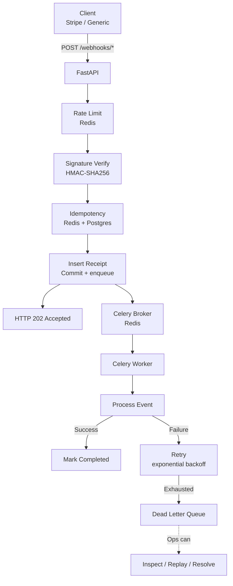

# Webhook Handler

A production-grade webhook processor that was built focusing on mainly handling duplicate events, logging proper records of failures, and maintaining trust with idempotency, signature verification, retries, and a dead-letter queue.

**Status:** Runs locally via Docker Compose, fully tested end-to-end including real failure/retry/DLQ scenarios under concurrent load (see [docs/dlq_evidence.md](./docs/dlq_evidence.md)). Cloud deployment is architected and documented (see [docs/architecture.md](./docs/architecture.md)) but not currently live.

---

## The Problem

Every service that accepts webhooks eventually hits the same wall:

- **Duplicates.** Stripe and other providers re-deliver webhooks when they don't receive a 2xx response — timeouts, network failures, or your own server errors. The same event can arrive twice, three times, or twenty.

- **Failures.** Your webhook handler often calls other services (payments API, notification service) to finish processing. If any of them is slow or down, the webhook can fail mid-processing — losing the event and leaving no audit trail.

- **Trust.** The webhook URL is public. Without cryptographic verification, anyone can POST a payload that looks like it came from Stripe. If your handler trusts it, attackers can trigger arbitrary business logic.

---

## Who This Is For

Any business that accepts payments, subscriptions, or third-party events via webhooks:

- **SaaS companies** using Stripe for billing — a duplicate webhook means a customer is charged twice.
- **E-commerce platforms** integrating with fulfillment, shipping, or inventory APIs.
- **Fintech apps** receiving transaction or KYC events from banking partners.

Without a system like this, each of those businesses eventually loses money to:

- Duplicate charges (which require refunds, customer support, and reputation damage)
- Silent failures (which trigger "my payment didn't go through" tickets)
- Forged events (which can trigger credits, refunds, or data exposure)

In one sentence: This system makes webhook handling safe, auditable, and recoverable — so a business can trust its integrations without building a team to babysit them.

## What This Does

- **Idempotent ingestion.** Redis fast-path + PostgreSQL unique constraint. Duplicates never double-process.
- **Signature verification.** Stripe's HMAC-SHA256 algorithm, implemented from scratch with timing-safe comparison and replay protection.
- **Async processing.** Webhooks return 202 in milliseconds; Celery workers handle the heavy lifting.
- **Exponential backoff retries.** Transient failures retry up to 5 times (60s → 960s). Permanent failures skip straight to the DLQ.
- **Dead Letter Queue.** Every terminal failure is recorded with full context. Ops can list, replay, or resolve.
- **Rate limiting.** Fixed-window Redis counter, per provider path.
- **Admin API auth.** All `/admin/*` routes require an `X-API-Key` header, verified with timing-safe comparison.
- **Prometheus metrics.** `/metrics` endpoint exposes counters, gauges, and histograms across all processes (API, worker, beat) using multiprocess mode.
- **Self-healing reconciliation.** A periodic sweep re-enqueues stuck webhooks. Lost tasks recover without human intervention.

---

## Architecture



**Components:**

| Layer   | Technology | Role                                                     |
| ------- | ---------- | -------------------------------------------------------- |
| API     | FastAPI    | Receive webhooks, verify signatures, enforce rate limits |
| Cache   | Redis      | Idempotency fast-path, rate limiting, Celery broker      |
| Storage | PostgreSQL | Source of truth for receipts + DLQ                       |
| Workers | Celery     | Async processing, retries, DLQ movement                  |

---

## Quick Start

### Option A — Docker Compose (recommended, tested end-to-end)

**Prerequisites:** Docker Desktop.

```bash
# 1. Clone
git clone <repo-url>
cd webhook-handler

# 2. Configure
cp .env.example .env.docker
# Edit .env.docker with your Stripe webhook secret and admin API key

# 3. Start the full stack (API, worker, beat, Postgres, Redis)
docker compose --env-file .env.docker up -d --build

# 4. Confirm everything is healthy
docker compose ps
```

### Option B — Native (Python + local Postgres/Redis)

Not covered by this repo's own test evidence — included for reference if you'd rather not use Docker, but verify it works in your environment before relying on it.

**Prerequisites:** Python 3.12+, PostgreSQL, Redis (or Memurai on Windows).

```bash
# 1. Install
python -m venv myenv

# Activate:
#   macOS/Linux:        source myenv/bin/activate
#   Windows (PowerShell): .\myenv\Scripts\Activate.ps1
#   Windows (cmd.exe):     myenv\Scripts\activate.bat

pip install -r requirements.txt

# 2. Configure
cp .env.example .env
# Edit .env with your PostgreSQL password and Stripe webhook secret

# 3. Create tables
python create_tables.py

# 4. Run (3 terminals)
uvicorn app.main:app --reload
celery -A app.workers.celery_app worker --pool=solo --loglevel=info
celery -A app.workers.celery_app beat --loglevel=info
```

---

## Verify It Works

```bash
# Health check — should return redis: true, postgres: true
curl http://localhost:8000/health
```

```bash
# Send a test webhook
curl -X POST http://localhost:8000/webhooks/generic \
  -H "Content-Type: application/json" \
  -H "Idempotency-Key: test-001" \
  -H "X-Event-Type: payment.test" \
  -d '{"user_id":"123","amount":100}'
```

Additional test resources (verify these still pass against the current code before relying on the claim below):

```bash
python tests/helpers/run_stripe_tests.py
cat tests/manual_test_checklist.md
```

---

## Test Evidence

15 end-to-end scenarios covering the checklist below. See `tests/manual_test_checklist.md` for the full procedure.

| #   | Scenario                             | Result                    |
| --- | ------------------------------------ | ------------------------- |
| 1   | Health check                         | 200, all checks true      |
| 2   | New webhook                          | 202 Accepted              |
| 3   | Duplicate (Redis fast-path)          | 200, cached response      |
| 4   | Conflict (same key, different event) | 409                       |
| 5   | Missing Idempotency-Key              | 422                       |
| 6   | Malformed JSON                       | 400                       |
| 7   | Stripe valid signature               | 202                       |
| 8   | Stripe invalid signature             | 400                       |
| 9   | Stripe stale timestamp               | 400                       |
| 10  | DLQ list                             | 200                       |
| 11  | DLQ replay — not found               | 404                       |
| 12  | Rate limit exceeded                  | 429                       |
| 13  | Redis flush → Postgres fallback      | 200, cached               |
| 14  | Transient failure → retry            | retry counter incremented |
| 15  | Permanent failure → DLQ              | dead_lettered + DLQ row   |

Plus three real concurrency/correctness bugs found and fixed during development — see [docs/bugs.md](./docs/bugs.md) — and a full real-failure trace with actual timestamps, DB rows, and API responses in [docs/dlq_evidence.md](./docs/dlq_evidence.md).

---

## Bugs Found and Fixed

Three real bugs surfaced during development — all found through testing, not code review. Full postmortems: [docs/bugs.md](./docs/bugs.md).

### Bug 1 — Idempotency fast-path bypass

The Redis cache stored the response keyed on the `idempotency_key` alone, without the `event_type`. A duplicate detection check on the fast path couldn't tell a genuine duplicate from a different event reusing the same key — so it returned the _wrong_ cached response with HTTP 200. Silent data loss.

**Fix:** store `event_type` in the cache, compare on the fast path, return 409 on mismatch.

### Bug 2 — Replay counter race condition

The DLQ replay cap (max 3) was enforced with a read-then-check-then-write pattern — a TOCTOU race. Two concurrent requests could both pass the check and both increment.

**Fix:** move the cap into the SQL UPDATE's `WHERE` clause so the check-and-write is one atomic statement. Verified under real 4-way concurrent replay traffic: exactly 3 succeeded, the 4th was correctly rejected, no lost updates.

### Bug 3 — Event-loop collision between independent task modules

`process_webhook.py` and the reconciliation sweep each kept their own private asyncio event loop, while sharing one SQLAlchemy connection pool. An asyncpg connection opened on one module's loop would fail when reused on the other's — crashing the sweep on every single invocation.

**Fix:** one shared event loop for the entire worker process instead of one private loop per module. Verified clean across ~3 hours and 25+ scheduled sweep ticks under real concurrent retry/DLQ activity, including through a system sleep/resume gap.

---

## Design Decisions

### Why use both PostgreSQL's unique constraint and Redis?

Redis is the fast path (sub-millisecond). PostgreSQL is the source of truth. If Redis goes down, correctness is preserved by the constraint — just slower.

### Why exponential backoff (60s → 960s)?

Fixed-delay retries hammer a failing downstream. Exponential gives it time to recover before we give up.

### Why a separate DLQ table instead of a status flag?

Different lifecycle. Different access pattern (ops vs. code). Different fields (why it failed vs. what it was).
See [docs/architecture.md](./docs/architecture.md).

### Why an API key instead of JWT for the admin API?

There is one admin identity (the operator). JWT is designed for multi-user auth with roles and sessions. An API key is one header, one env var, and no token lifecycle to manage. When the number of admin identities grows, this becomes a JWT or OAuth concern.

### Why Prometheus multiprocess mode?

Each container (API, worker, beat) runs in its own process, so `prometheus_client` metrics would be per-process — invisible in a central `/metrics` endpoint. Multiprocess mode uses a shared directory (`PROMETHEUS_MULTIPROC_DIR`) where each process writes its own `.db` file. The `/metrics` reader merges them via `MultiProcessCollector`. Result: one scrape sees the whole system.

---

## Project Structure

```text
webhook-handler/
├── app/
│   ├── api/           # FastAPI routers + middleware
│   ├── core/          # Config, logging, database, exceptions
│   ├── models/        # SQLAlchemy tables + enums
│   ├── repositories/  # DB access layer (one file per table)
│   ├── services/      # Business logic + orchestration
│   └── workers/       # Celery app + tasks
├── docs/              # Architecture, bug postmortems, evidence
├── tests/             # Manual checklist + pytest e2e
├── scripts/           # Health check and sweep utilities (for further use)
├── migrations/        # Alembic (for further use)
└── create_tables.py   # Bootstrap script
```

---

## License

MIT — see [LICENSE](./LICENSE).
