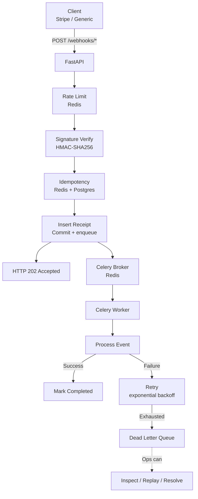

# Architecture

A walkthrough of how the webhook-handler is structured, and why each piece exists.

The goal is not to describe *what* each file does (the code does that). It's to explain the *decisions* — why this shape, not some other shape.

---

## The System at a Glance



Three components in the request path (FastAPI, Redis, Postgres) and one asynchronous component (Celery). The critical design choice is the **boundary between them** — where acceptance ends and processing begins.

---

## Layered Design

The codebase is split into five layers. Each layer has exactly one responsibility.

| Layer | Location | Responsibility |
|-------|----------|----------------|
| API | `app/api/` | HTTP boundary. Parse, validate, respond. |
| Service | `app/services/` | Business logic and orchestration. |
| Repository | `app/repositories/` | Database access. One file per table. |
| Worker | `app/workers/` | Async processing, retries, DLQ movement. |
| Core | `app/core/` | Config, logging, DB engine, exceptions. |

**The rule that keeps this clean:** a layer may only call the layer below it. The API calls services. Services call repositories. Repositories call the DB. Nothing calls upward.

Why this matters: if the API layer starts writing SQL, the business logic becomes untestable without HTTP. If a service starts formatting HTTP responses, it can no longer be called from a Celery task.

**Layer boundaries are the only thing standing between "testable" and "spaghetti".**

---

## Request Lifecycle

A webhook goes through nine steps, in order. Each step has a reason to exist *before* the next one.

```text
1. Rate limit check (Redis)
2. Read raw body (bytes)
3. Verify signature (HMAC)
4. Check replay window (timestamp)
5. Idempotency check (Redis fast path)
6. Insert receipt (Postgres, unique constraint)
7. Commit
8. Cache in Redis
9. Enqueue Celery task
10. Return 202
```

**Why this order matters:**

- **Rate limit first** — cheapest rejection. A rejected request touches nothing else.
- **Raw body before signature** — Stripe signs the exact bytes. Parsing JSON first would invalidate the signature.
- **Signature before idempotency** — an unsigned request should never reach the idempotency layer, or an attacker could probe keys.
- **Idempotency before insert** — the fast path is cheaper than the unique constraint violation.
- **Commit before enqueue** — if the process crashes between the two, the receipt is durable and the sweep recovers it. The reverse order is a lost-update bug.

**Every step that can fail early saves work for every step after it.**

---

## Idempotency: Two Layers, One Truth

Duplicate detection uses both Redis and Postgres, but they play different roles.

**Redis is the fast path.** A sub-millisecond `GET` catches 99% of duplicates before any DB work happens. If Redis is down, the system degrades — not fails.

**Postgres is the source of truth.** The unique constraint on `(provider, idempotency_key)` is the ultimate guarantee. No matter what, a duplicate cannot create a second row.

**Why not just Redis?**
Cache eviction, restarts, and network partitions all cause Redis to lose keys. If Redis were the only layer, a duplicate arriving after a cache flush would be processed twice.

**Why not just Postgres?**
Every request would hit the DB for a uniqueness check. Under high load, the DB becomes the bottleneck. Redis absorbs the vast majority of checks.

**The rule:** the fast path is optional. The source of truth is required. The system is correct without Redis, just slower.

See [bugs.md](./bugs.md) for a real bug that surfaced from this asymmetry.

---

## Signature Verification

Stripe signs each webhook with HMAC-SHA256. The system verifies the signature before accepting the payload.

The signed string is:

```text
{timestamp}.{raw_body}
```

**Why include the timestamp?** To prevent replay attacks. An attacker who captures a valid webhook cannot re-send it an hour later — the timestamp check fails first.

**Why use raw bytes?** Because Stripe signed the exact bytes it sent. Any re-serialization (JSON parse + dump) can change whitespace, key order, or number formatting. The signature would no longer match.

**Why constant-time comparison?** A naive `==` leaks information through timing. An attacker can measure response time and infer the correct signature one byte at a time. `hmac.compare_digest` always takes the same time, regardless of where the mismatch is.

**Why implement it manually?** Because the algorithm is simple enough to reason about, and understanding it is more valuable than importing a library. This is a portfolio project — the point is comprehension, not shortcutting.

---

## Async Processing

The API returns 202 (Accepted) within milliseconds. The actual processing happens in a Celery worker, in a separate process.

**Why separate?**

Webhook providers time out. Stripe retries if it doesn't receive a 2xx response within ~20 seconds. If our API took 15 seconds to call a downstream payment API, we'd be right at the edge of a timeout — and any slowdown would trigger duplicate retries.

By returning 202 immediately and processing asynchronously:

- **The provider's timeout is never a concern.** We return in 5-50ms.
- **Downstream slowness doesn't affect webhook acceptance.** If a payment API takes 30 seconds, the API doesn't care — the worker waits, not the HTTP request.
- **Retries are natural.** A Celery task can be retried by the worker without the caller knowing anything happened.

**The cost:** eventual consistency. The caller gets "accepted" before the work is done. For webhooks, this is fine — the provider is already handling eventual consistency on their end.

---

## Failure Classification

Not all errors are equal. The system separates failures into two categories:

| Category | Example | Behavior |
|----------|---------|----------|
| Transient | Network timeout, 503 from downstream, DB deadlock | Retry with exponential backoff |
| Permanent | Insufficient funds, invalid account, missing metadata | Move to DLQ immediately |

**Why distinguish?**

Retrying a permanent failure wastes:
- Worker time (5 retries × 30 minutes = 2.5 hours wasted per event)
- DLQ space (the event could have been there sooner)
- Ops attention (a "failing" event that could never succeed)

**The classification lives in the business logic.** It's the *only* thing that knows whether a given failure is likely to resolve itself. The retry machinery is generic; the decision is domain-specific.

**The rule:** retry is not a strategy. It's a response to a specific kind of problem.

---

## Retry Strategy: Exponential Backoff

Retries are scheduled with delays that double each attempt:

```text
Attempt 1: 60s
Attempt 2: 120s
Attempt 3: 240s
Attempt 4: 480s
Attempt 5: 960s
Total: ~30 minutes
```

**Why exponential, not fixed?**

Fixed-delay retries assume the failure lasts a predictable duration. It doesn't. A network blip lasts seconds; a Stripe outage might last 15 minutes. With fixed 60-second delays, we'd hit the retry cap in 5 minutes — before an outage was over.

Exponential backoff gives the downstream system time to recover, *and* avoids hammering it while it's already struggling.

**Why stop at 5 attempts?**

After 30 minutes of retries, either the problem is systemic (not a blip) or the event itself is broken. Either way, further retries waste resources. The DLQ is the right destination — a human can investigate.

---

## Dead Letter Queue

The DLQ is where terminally failed webhooks live. It's a separate table, not a status flag.

**Why a separate table?**

Three reasons:

1. **Different lifecycle.** Receipts age out (or are archived). DLQ entries stay until resolved.
2. **Different access pattern.** Receipts are queried by the system. DLQ entries are queried by ops.
3. **Different fields.** Receipts care about "what happened." DLQ entries care about "why it failed."

Merging them would bloat both. Splitting them keeps each query fast.

**The DLQ entry is a snapshot, not a reference.**

We copy `provider`, `event_type`, and `payload` into the DLQ row at the moment of failure. This lets ops query the DLQ without joining to `webhook_receipts` — and it preserves the state exactly as it was when the failure occurred, even if the receipt is later modified.

**Never delete DLQ entries.**

Even after resolution, entries remain. They're:
- An audit trail (regulatory requirement for payment systems)
- A pattern source (three failures of the same event type signals a systemic problem)
- A debugging aid (what did the state look like when this started failing?)

If storage becomes an issue, **archive to cold storage** — never delete.

---

## Ops Interface

The DLQ exists for a human to act on. The admin API exposes three operations:

| Operation | Endpoint | Purpose |
|-----------|----------|---------|
| List | `GET /admin/dlq` | See unresolved failures |
| Replay | `POST /admin/dlq/{id}/replay` | Re-enqueue after fixing the root cause |
| Resolve | `POST /admin/dlq/{id}/resolve` | Mark resolved without replaying |

**Replay is capped at 3 attempts.**

Why? Because an unbounded replay button is a footgun. An ops person clicking repeatedly on a broken webhook would flood the worker with the same failing task. The cap forces a pause: after 3 attempts, investigate the root cause instead of retrying.

**The cap is enforced atomically.** See [bugs.md](./bugs.md) for the race condition that was found and fixed in the original implementation.

**Resolution is separate from replay.**

An entry can be resolved *without* replaying. Sometimes the failure was handled outside the system (customer refunded manually, issue acknowledged). The `resolution_note` field records why.

---

## Rate Limiting

Webhook endpoints are public. Rate limiting is the first line of defense.

**Fixed window, per provider path.**

```text
Key:   rl:{path_prefix}:{minute_epoch}
Type:  Integer (INCR)
TTL:   70 seconds
```

**Why fixed window?**
- Simple to implement
- One Redis key per (path, minute) — cheap
- Good enough for the threat model (prevent flooding, not adversary gaming)

**Why per provider path, not per client?**
- For Stripe, there's one client — Stripe. Per-client limits make no sense.
- For generic, we don't trust the caller's identity. Per-client limits would require API keys, which we haven't built yet.
- Per path is the right unit of trust: everything under `/webhooks/stripe` shares a bucket.

**Why does the rate limiter fail open?**
If Redis is down, requests are allowed. The alternative — failing closed — would turn a Redis outage into a webhook outage. Rate limiting is a safety valve, not a critical path dependency.

---

## Configuration

All settings live in one place: `app/core/config.py`, loaded from environment variables.

**Why no defaults for required fields?**

`DATABASE_URL`, `REDIS_URL`, and `STRIPE_WEBHOOK_SECRET` have **no defaults**. If they're not configured, the app refuses to start.

This is deliberate. A default `DATABASE_URL` would silently connect to the wrong database in production. A missing secret would verify zero signatures and accept all traffic. **Fail-fast at startup is the correct behavior for security-critical config.**

**Why defaults for tunable values?**

Timeouts, TTLs, rate limits, and retry counts have sensible defaults (60s, 24h, 100/min, 5). They're tunable, not environment-specific. A developer cloning the repo should be able to run it with a two-line `.env`.

**The principle:** required identity has no default; tunable behavior does.

---

## Logging

Structured text logs, one line per event, with a namespace per module.

```text
2026-09-29 11:15:00 | INFO | webhook-handler.api.stripe | Received event evt_123
```

**Why namespaced?**

The logger name tells you which component logged the message. `webhook-handler.api.stripe` vs `webhook-handler.workers.process_webhook` — you can filter logs by component without grepping for text.

**Why structured?**

Parsing logs programmatically (for dashboards, alerts, or investigation) is trivial when the format is consistent. Free-form `print()` statements are not parseable.

**Why not JSON logs?**

JSON is better for production systems with log aggregators (Datadog, Splunk). For a development and portfolio project, plain text is more readable. The logger format is a single line to change if the deployment target requires JSON.

---
## Observability

The system exposes Prometheus metrics at `/metrics`.

**Metrics collected:**

| Metric | Type | Labels | Purpose |
|--------|------|--------|---------|
| `webhook_received_total` | Counter | provider, event_type | Are webhooks arriving? |
| `webhook_duplicate_total` | Counter | provider | Idempotency effectiveness |
| `webhook_processed_success_total` | Counter | provider, event_type | Success rate |
| `webhook_processed_failure_total` | Counter | provider, event_type, error_category | Failure rate by category |
| `webhook_retries_total` | Counter | provider, error_category | Retry rate |
| `webhook_processing_duration_seconds` | Histogram | provider, event_type | Latency distribution |
| `webhook_dlq_size` | Gauge | (none) | Current DLQ backlog |

**Multiprocess mode:**

Metrics come from multiple processes:
- **api** — receives webhooks, counts `received` and `duplicate`
- **worker** — processes webhooks, counts `processed_success`, `processed_failure`, `retries`, records `duration`
- **beat** — runs the reconciliation sweep (doesn't currently emit webhook metrics)

Each process writes to `/tmp/prometheus_multiproc/*.db` (mounted from a shared Docker volume). The `/metrics` endpoint reads all `.db` files via `MultiProcessCollector` and merges them into a single exposition.

**Why multiprocess mode matters:**

Without it, each process would have its own in-memory metric registry. A `/metrics` scrape would only see the metrics of the process handling the scrape (the API). Worker metrics would be invisible — you'd never know how many webhooks actually succeeded.

**What this enables:**

- **Prometheus scraping** — standard exposition format, works with any Prometheus-compatible scraper
- **Grafana dashboards** — visualize success rate, latency, retries
- **Alerting** — "alert if DLQ size > 100" or "alert if retry rate > 10/min"
- **SLO tracking** — "99% of webhooks processed within 30 seconds"

## Reconciliation Sweep

A Celery Beat task runs every 5 minutes. It finds receipts stuck in `pending` past a threshold and re-enqueues their processing tasks. Idempotent by design: the re-enqueued task checks receipt status before acting, so running the sweep twice is safe.

Each receipt carries a `sweep_attempts` counter. After `max_sweep_attempts` (default 3), it moves to the DLQ instead of being re-enqueued forever.

**Why it matters:** Celery tasks can be lost (worker crash, broker restart, message drop). Without the sweep, receipts would sit in `pending` forever. The sweep turns this failure mode from "requires manual intervention" into "self-heals in ≤5 minutes."

## What This Architecture Is Not

This system is production-ready for a small-to-medium deployment. It is **not** designed for:

- **Multi-region failover.** One Postgres instance, one Redis instance.
- **Horizontal scale beyond a few workers.** Celery scales, but the DB is a single point.
- **Sub-second latency SLAs.** Async processing means end-to-end latency is seconds, not milliseconds.
- **PCI-DSS compliance.** Card data never touches this system — Stripe handles that — but full compliance would require more.

**Naming the limits is more useful than pretending they don't exist.** Any senior engineer reading this document knows what's missing; listing it explicitly is a signal of judgment.

---
## Deployment

The whole stack is packaged as a Docker Compose application. One command starts everything:

```bash
docker compose --env-file .env.docker up -d
```
**Services:**

| Service | Image | Purpose |
|---------|-------|---------|
| api | webhook-handler:latest | FastAPI + uvicorn (public, port 8000) |
| worker | webhook-handler:latest | Celery worker (internal only) |
| beat | webhook-handler:latest | Celery beat scheduler (internal only) |
| postgres | postgres:16-alpine | Database (host port 5433) |
| redis | redis:7-alpine | Cache + Celery broker (host port 6380) |

Key design choices:

One image, three commands. api, worker, and beat share the same built image. Only their command: differs. This keeps the build fast and the code consistent.

Only the API is exposed. Postgres, Redis, worker, and beat have no host port mappings. They can only be reached from within the Docker network.

Named volumes for state. postgres_data and redis_data persist across container restarts. Only docker compose down -v deletes them.

Service-name DNS. Containers talk to each other via service names (postgres:5432, redis:6379). From the host, you use localhost:5433 and localhost:6380.

## Further Reading

- [bugs.md](./bugs.md) — the two real bugs found during development
- [../README.md](../README.md) — project overview and quick start
- [../tests/manual_test_checklist.md](../tests/manual_test_checklist.md) — 15 end-to-end test scenarios